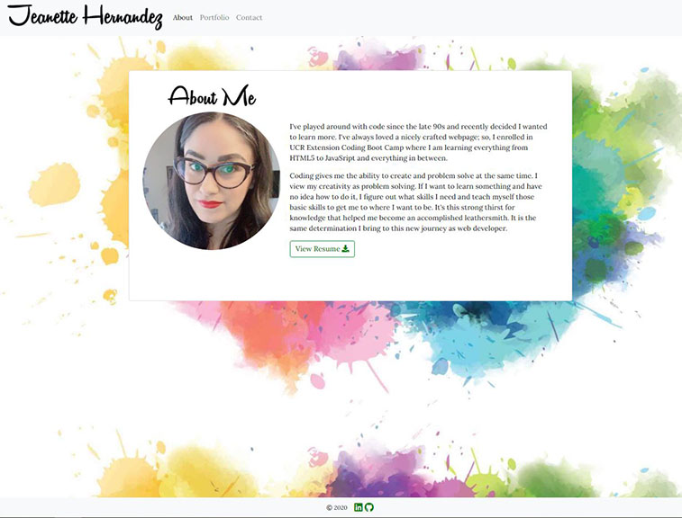
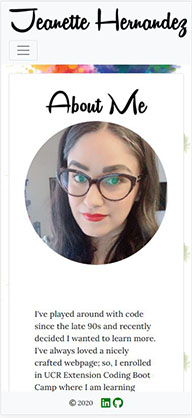

## Responsive Portfolio
---
## Description:

This updated portfolio features a working navbar that is also mobile responsive, along with a footer with LinkIn and GitHug icons that will take you to those sites. The portfolio page features eat-da-burger, weather dashboard, workday scheduler, my group project, Alexandria. 

With this portfolio update I went a head and created a working contact form, deployed it to heroku, and linked a custom domain to the heroku deployment.

<a href="www.thewebdevstudio.com"> Click Here </a>to visit my portfolio!

---

---

## Resources:

This video tutorial helped me through the process of creating a working contact form and highly recommned it. 

<a href="https://www.youtube.com/watch?v=JpcLd5UrDOQ"> Submit Form Tutorial </a> by Esterling Accime
  
---
## MIT License:

Copyright (c) [2020] [Jeanette Hernandez]

Permission is hereby granted, free of charge, to any person obtaining a copy
of this software and associated documentation files (the "Software"), to deal
in the Software without restriction, including without limitation the rights
to use, copy, modify, merge, publish, distribute, sublicense, and/or sell
copies of the Software, and to permit persons to whom the Software is
furnished to do so, subject to the following conditions:

The above copyright notice and this permission notice shall be included in all
copies or substantial portions of the Software.

THE SOFTWARE IS PROVIDED "AS IS", WITHOUT WARRANTY OF ANY KIND, EXPRESS OR
IMPLIED, INCLUDING BUT NOT LIMITED TO THE WARRANTIES OF MERCHANTABILITY,
FITNESS FOR A PARTICULAR PURPOSE AND NONINFRINGEMENT. IN NO EVENT SHALL THE
AUTHORS OR COPYRIGHT HOLDERS BE LIABLE FOR ANY CLAIM, DAMAGES OR OTHER
LIABILITY, WHETHER IN AN ACTION OF CONTRACT, TORT OR OTHERWISE, ARISING FROM,
OUT OF OR IN CONNECTION WITH THE SOFTWARE OR THE USE OR OTHER DEALINGS IN THE
SOFTWARE.